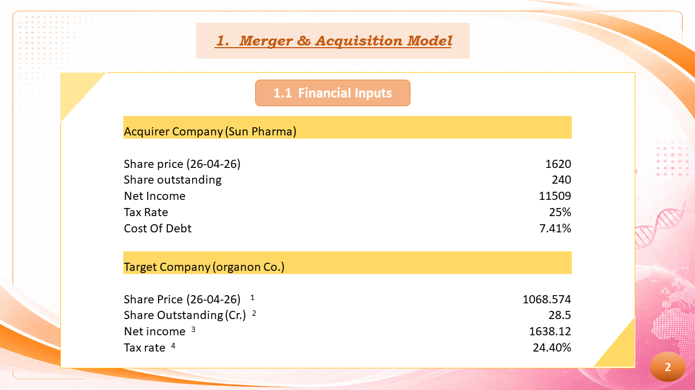
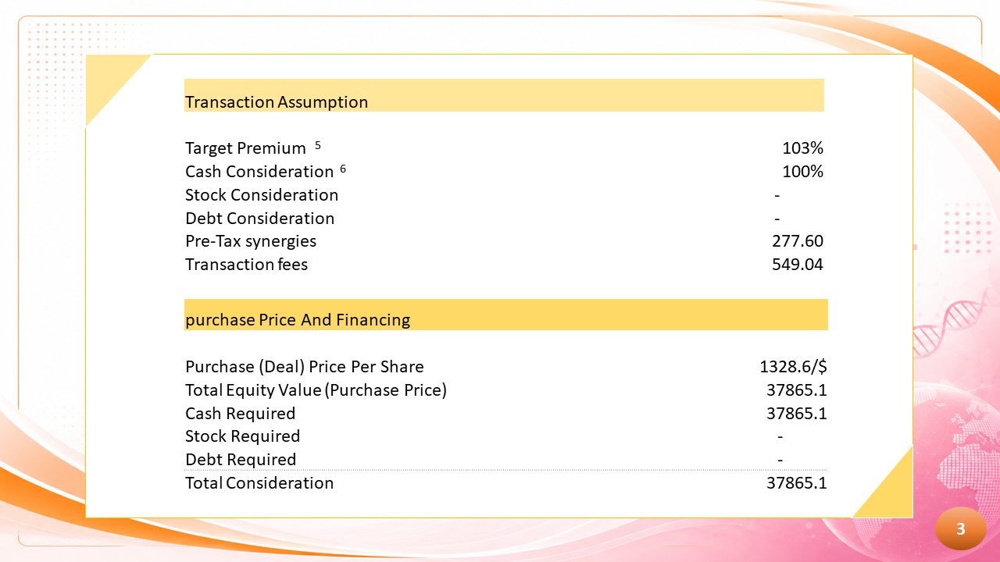
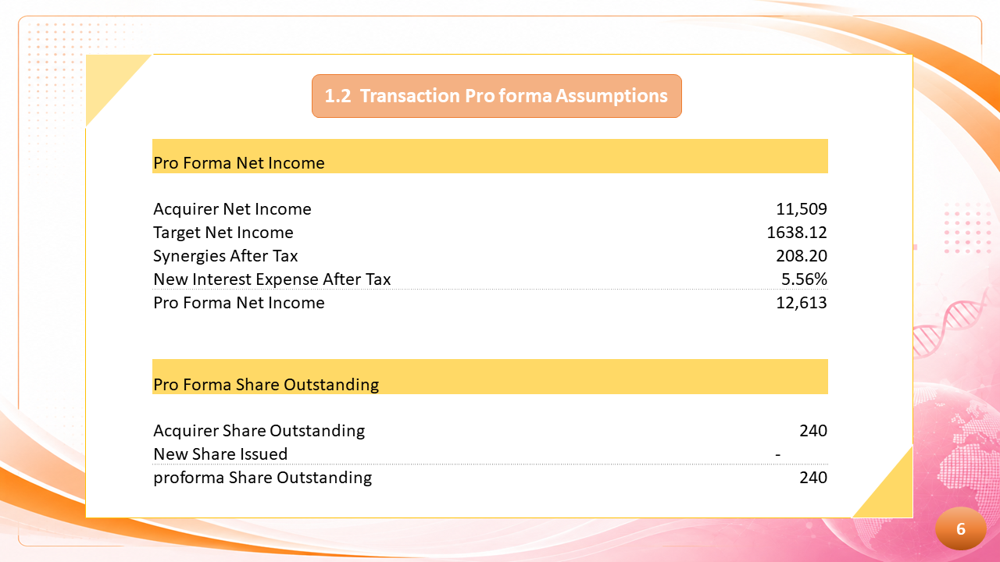
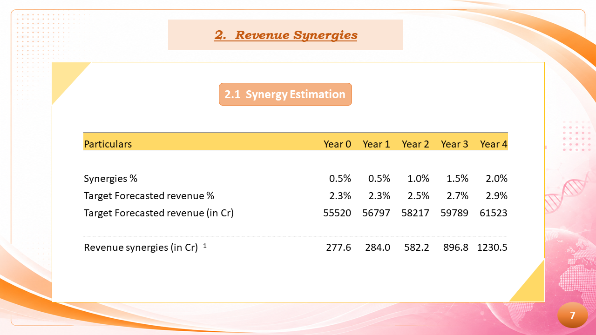
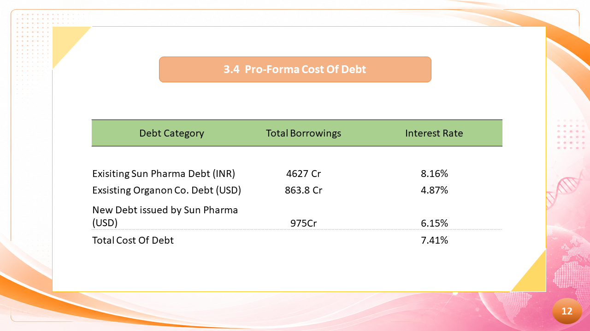
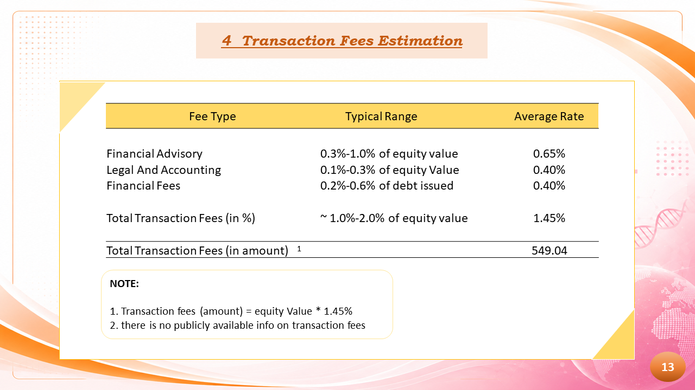
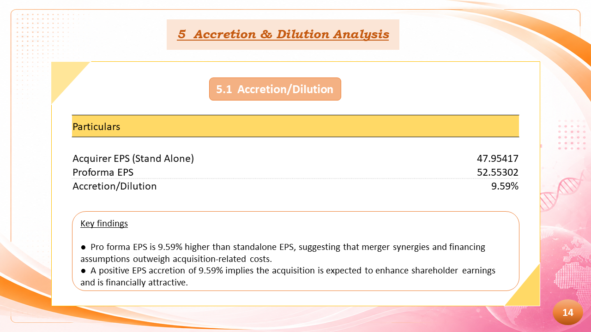

# Sun Pharma–Organon M&A Financial Model

## Project Overview

This project presents an illustrative Mergers & Acquisitions (M&A) financial model for a potential acquisition of Organon & Co. by Sun Pharmaceutical Industries Ltd.

The model covers:

- Transaction assumptions
- Purchase price calculation
- Revenue synergies
- Transaction fee estimation
- Pro forma cost of debt
- Pro forma net income
- Pro forma EPS
- Accretion & dilution analysis

---

## Key Model Outputs

| Metric | Result |
|---|---:|
| Target Purchase Price / Share | ₹1,328.60 |
| Total Equity Purchase Price | ₹37,865.10 Cr |
| Transaction Fees | ₹549.04 Cr |
| Pro Forma Cost of Debt | 7.41% |
| Standalone EPS | ₹47.95 |
| Pro Forma EPS | ₹52.55 |
| EPS Accretion | 9.59% |

---

## Project Files

### Excel Financial Model
[📊 Download Excel Model](./Sun_pharma%20_M%26A_Model.xlsx)

### PDF Report
[📄 View / Download M&A Model PDF](./Merger%20And%20Acquisition%20Model.pdf)

---

# Screenshots

## 1. Financial Inputs

---

## 2. Transaction Assumptions

---

## 3. Revenue Synergies

---

## 4. Pro Forma Cost of Debt

---

## 5. Transaction Fees Estimation

---

## 6. Accretion & Dilution Analysis

---

# Skills Demonstrated

- M&A Financial Modeling
- Accretion & Dilution Analysis
- EPS Analysis
- Revenue Synergy Analysis
- Transaction Fee Estimation
- Debt Financing Analysis
- Pro Forma Financial Analysis
- Corporate Finance
- Microsoft Excel

---
